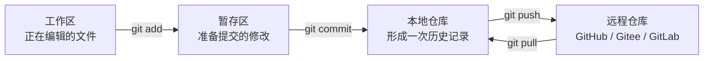
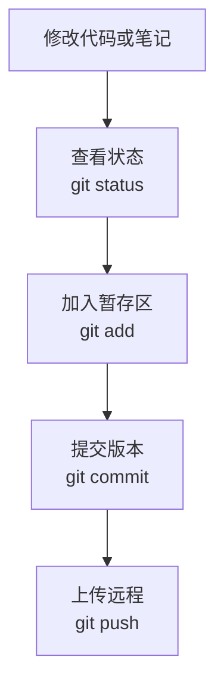
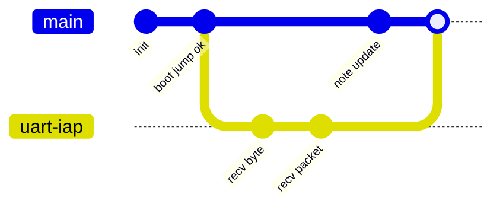
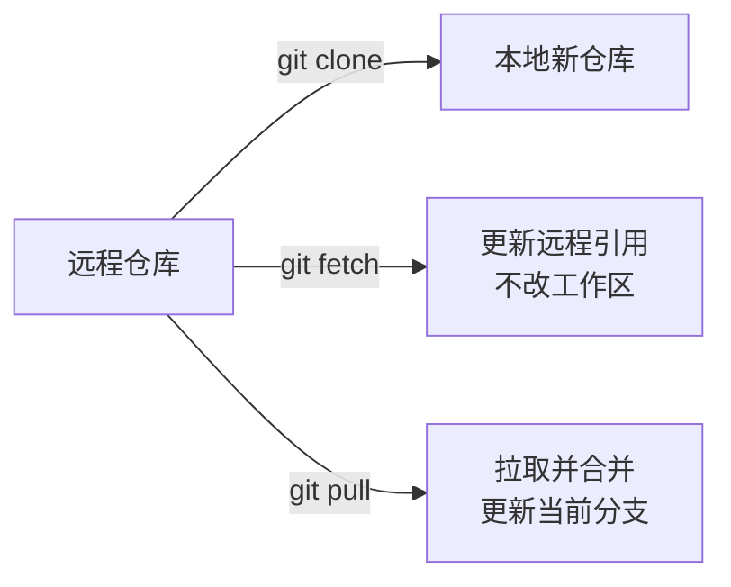
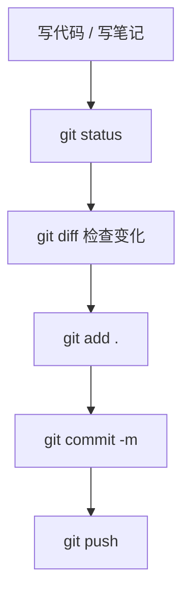
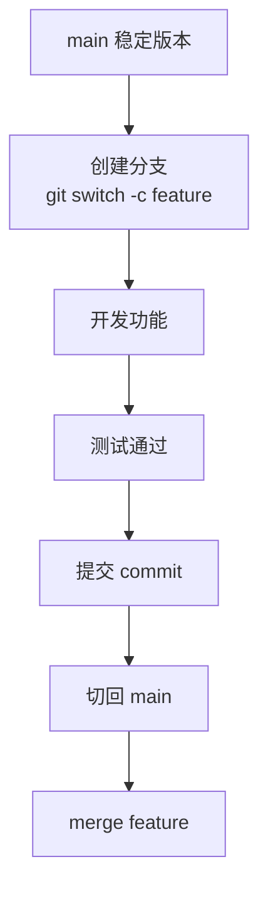
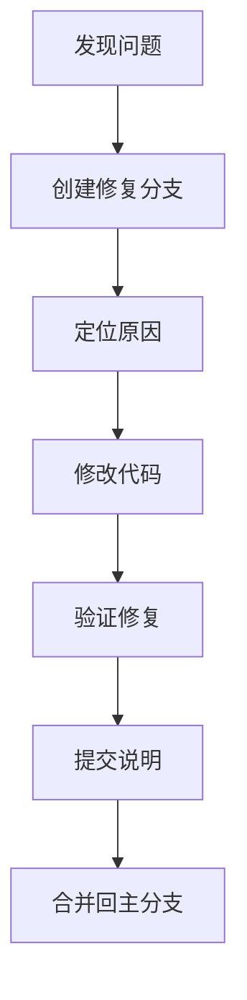

---
tags:
  - git
  - 版本管理
  - 工程管理
  - obsidian
topic: Git 管理
status: active
created: 2026-05-07
updated: 2026-05-07
---

# Git 管理笔记

## 1. Git 是什么

Git 是一个版本管理工具，用来记录项目文件的变化历史。

可以把它理解成：

```text
给代码项目做“时间线存档”。
```

普通保存只能保存当前状态，而 Git 可以记录：

- 哪些文件改了。
- 每次改了什么。
- 谁改的。
- 为什么改。
- 什么时候改。
- 必要时回到某个历史版本。

对于 STM32、ESP32、Qt、Web、论文、笔记项目来说，Git 都很有用。它不是只给大型团队用的，个人学习也非常适合。

## 2. Git 的核心思路

Git 最重要的是理解三个区域：

```text
工作区 -> 暂存区 -> 本地仓库
```



三个区域的含义：

| 区域 | 作用 | 类比 |
|---|---|---|
| 工作区 | 你正在改的文件 | 草稿纸 |
| 暂存区 | 准备放进下一次提交的内容 | 待打包清单 |
| 本地仓库 | 已经提交形成的历史版本 | 本地档案馆 |
| 远程仓库 | 云端备份和协作位置 | 云端档案馆 |

一句话记忆：

```text
改文件在工作区，add 放进暂存区，commit 生成历史记录，push 上传远程。
```

## 3. 最小使用流程

日常最常用的流程：



对应命令：

```bash
git status
git add .
git commit -m "说明这次改了什么"
git push
```

解释：

- `git status`：查看当前项目有什么变化。
- `git add .`：把当前目录下的修改加入暂存区。
- `git commit -m "..."`：生成一次本地历史记录。
- `git push`：把本地提交上传到远程仓库。

## 4. 第一次使用 Git

### 4.1 配置用户名和邮箱

只需要配置一次：

```bash
git config --global user.name "你的名字"
git config --global user.email "你的邮箱"
```

查看配置：

```bash
git config --global --list
```

### 4.2 初始化仓库

在项目根目录执行：

```bash
git init
```

执行后，项目里会出现一个隐藏目录：

```text
.git
```

这个目录就是 Git 仓库的核心数据库。不要手动删除它。

### 4.3 第一次提交

```bash
git status
git add .
git commit -m "初始化项目"
```

提交完成后，Git 就记住了当前项目状态。

## 5. 查看项目状态

最常用：

```bash
git status
```

它会告诉你：

- 哪些文件新建了。
- 哪些文件修改了。
- 哪些文件删除了。
- 哪些文件已经加入暂存区。
- 当前有没有可以提交的内容。

建议养成习惯：

```text
每次提交前先 git status。
```

## 6. 查看修改内容

查看工作区具体改了什么：

```bash
git diff
```

查看已经 `add` 到暂存区的内容：

```bash
git diff --cached
```

常用节奏：

```bash
git status
git diff
git add .
git diff --cached
git commit -m "xxx"
```

这样可以避免把不该提交的内容混进去。

## 7. 提交 Commit

提交命令：

```bash
git commit -m "提交说明"
```

好的提交说明应该回答：

```text
这次为什么改？
这次改了什么？
```

推荐写法：

```bash
git commit -m "完成 Bootloader 跳转 App 实验"
git commit -m "补充 IAP 学习笔记第二章"
git commit -m "修复 App 向量表偏移配置"
```

不推荐：

```bash
git commit -m "改了"
git commit -m "111"
git commit -m "update"
```

## 8. 提交粒度

提交粒度就是“一次 commit 应该包含多少改动”。

推荐：

```text
一个 commit 只做一件相对完整的事。
```

例如：

```text
提交 1：创建 Bootloader 工程
提交 2：创建 App 工程并修改 IROM 地址
提交 3：实现 Bootloader 跳转 App
提交 4：整理第二章学习笔记
```

不推荐：

```text
一个 commit 同时改 Bootloader、App、笔记、图片、无关配置。
```

好的提交粒度有两个好处：

- 日后容易看懂历史。
- 出问题时容易回退。

## 9. 分支 Branch

分支可以理解成：

```text
从当前项目拉出一条实验路线。
```

主分支继续保持稳定，新功能在新分支里开发。



常用命令：

```bash
git branch
git branch uart-iap
git checkout uart-iap
```

新版本 Git 推荐：

```bash
git switch uart-iap
git switch -c uart-iap
```

含义：

- `git branch`：查看分支。
- `git switch -c uart-iap`：创建并切换到 `uart-iap` 分支。
- `git switch main`：切回主分支。

## 10. 合并 Merge

当一个分支功能完成后，可以合并回主分支。

```bash
git switch main
git merge uart-iap
```

合并前建议：

```bash
git status
```

确认当前没有未提交修改。

## 11. 远程仓库

远程仓库通常是 GitHub、Gitee、GitLab 等。

查看远程仓库：

```bash
git remote -v
```

添加远程仓库：

```bash
git remote add origin <远程仓库地址>
```

第一次推送：

```bash
git push -u origin main
```

后续推送：

```bash
git push
```

拉取远程更新：

```bash
git pull
```

简单理解：

```text
push：把本地提交上传到远程。
pull：把远程更新拉到本地。
```

## 12. clone、pull、fetch 的区别

| 命令 | 作用 | 使用场景 |
|---|---|---|
| `git clone` | 第一次把远程仓库下载到本地 | 新电脑、新项目 |
| `git fetch` | 只拉取远程信息，不自动合并 | 想先看看远程有什么变化 |
| `git pull` | 拉取远程并合并到当前分支 | 日常同步 |

流程图：



## 13. 回退和撤销

Git 的撤销命令要谨慎使用。先记住几个安全常用的。

### 13.1 撤销工作区某个文件修改

```bash
git restore 文件名
```

作用：

```text
把某个文件恢复到最近一次 commit 的状态。
```

注意：未提交的修改会丢失。

### 13.2 取消暂存

如果已经 `git add`，但还没 commit：

```bash
git restore --staged 文件名
```

作用：

```text
把文件从暂存区拿回来，但保留工作区修改。
```

### 13.3 查看历史

```bash
git log --oneline
```

更直观：

```bash
git log --oneline --graph --decorate --all
```

### 13.4 不建议初学乱用的命令

下面这些命令很有用，但初学时要谨慎：

```bash
git reset --hard
git clean -fd
git push --force
```

它们可能会丢失本地改动或覆盖远程历史。

## 14. .gitignore

`.gitignore` 用来告诉 Git：

```text
哪些文件不需要纳入版本管理。
```

嵌入式 Keil 工程里，通常不建议提交大量中间编译文件。

示例：

```gitignore
# Keil build outputs
*.o
*.d
*.crf
*.lst
*.map
*.axf
*.hex
*.bin
*.build_log.htm

# User local files
*.uvguix.*
*.uvoptx

# Temporary files
*.bak
*.tmp
```

是否忽略 `.hex` 和 `.bin` 要看项目策略：

- 如果固件产物需要归档发布，可以单独放到 `release/` 并保留。
- 如果只是本地编译产物，通常忽略。

## 15. 嵌入式项目推荐管理方式

对于 STM32 IAP 项目，可以这样管理：

```text
iap_project/
  iap_bootloadr/
  iap_app/
  docs/
  tools/
  README.md
  .gitignore
```

推荐提交节奏：

```text
1. 工程能编译后提交一次。
2. 每跑通一个实验提交一次。
3. 每整理完一章笔记提交一次。
4. 修改关键地址、Flash 分区、启动逻辑时单独提交。
```

示例：

```bash
git add iap_bootloadr iap_app iap升级
git commit -m "完成最小 Bootloader 跳转 App 实验"
```

## 16. 常见工作流

### 16.1 个人学习项目



### 16.2 新功能分支



### 16.3 修复 bug



## 17. Git 常用命令速查

| 命令 | 作用 |
|---|---|
| `git init` | 初始化仓库 |
| `git status` | 查看当前状态 |
| `git add .` | 添加所有修改到暂存区 |
| `git add 文件名` | 添加指定文件 |
| `git commit -m "说明"` | 提交版本 |
| `git log --oneline` | 查看简洁历史 |
| `git diff` | 查看未暂存修改 |
| `git diff --cached` | 查看已暂存修改 |
| `git branch` | 查看分支 |
| `git switch -c 分支名` | 创建并切换分支 |
| `git switch 分支名` | 切换分支 |
| `git merge 分支名` | 合并分支 |
| `git remote -v` | 查看远程仓库 |
| `git push` | 上传到远程 |
| `git pull` | 拉取远程更新 |
| `git restore 文件名` | 撤销工作区修改 |
| `git restore --staged 文件名` | 取消暂存 |

## 18. 新手最容易踩的坑

### 18.1 忘记提交

现象：

```text
代码改了很多，但没有 commit。
```

建议：

```text
每完成一个小阶段就提交一次。
```

### 18.2 一次提交太多东西

现象：

```text
一个 commit 同时包含多个功能、笔记、临时文件。
```

建议：

```text
一个 commit 做一件事。
```

### 18.3 把编译中间文件全提交了

现象：

```text
仓库里全是 .o、.d、.crf、.lst。
```

建议：

```text
写好 .gitignore。
```

### 18.4 在不清楚后果时强制覆盖

危险命令：

```bash
git reset --hard
git clean -fd
git push --force
```

建议：

```text
不确定时先 git status，再备份或询问。
```

## 19. 推荐习惯

每天开始写代码前：

```bash
git status
git pull
```

写代码过程中：

```bash
git status
git diff
```

完成一个阶段：

```bash
git add .
git commit -m "说明本阶段完成了什么"
git push
```

重要实验成功时：

```bash
git commit -m "完成 xxx 实验"
```

例如：

```bash
git commit -m "完成 Bootloader 跳转 App 实验"
```

## 20. 一句话总结

Git 管理的核心不是命令多，而是养成一个稳定节奏：

```text
先看状态，再看差异；
小步提交，说明原因；
主线稳定，分支实验；
远程备份，出错可回。
```

记忆口诀：

```text
status 看现场，
diff 看改动，
add 选内容，
commit 做存档，
push 传远端。
```
